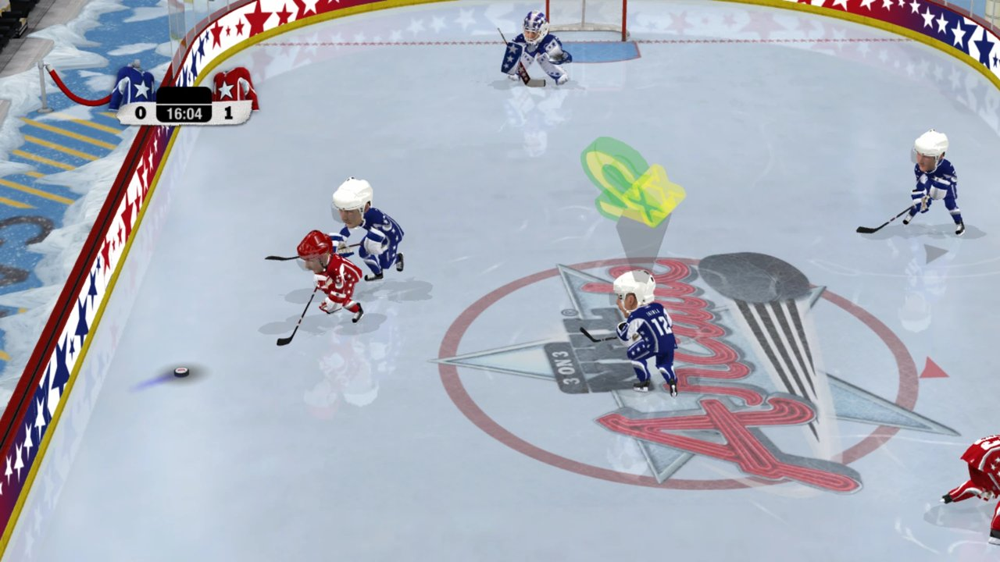
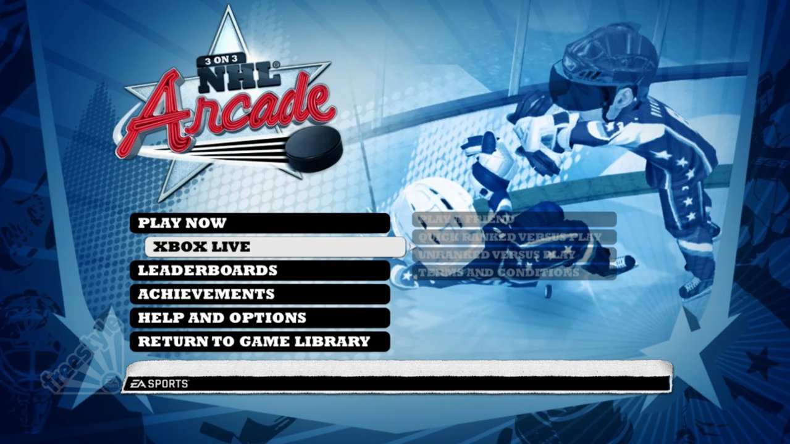

# 3 on 3 NHL Arcade – PC Port

A native PC port of **3 on 3 NHL Arcade** (Xbox 360, Xbox Live Arcade, 2009), made by statically
recompiling the original PowerPC executable to C++ with
[ReXGlue](https://github.com/rexglue/rexglue-sdk). No emulator at runtime.

## Quick start

You need your own copy of the game's Xbox Live Arcade package (title ID `58410975`).
This repository and its releases contain **no game code or data**.

1. Download the [latest release](https://github.com/Wndwsqrrl/3on3NHL-recomp/releases/latest)
   and unzip it.
2. Put your XBLA package next to it: the file inside `58410975\000D0000\`, or the whole
   `58410975` folder.
3. Run `NHL 3on3 Launcher.exe`, click **Set up game**, then **Play**.

## System requirements

| | |
|---|---|
| OS | Windows 10 or 11, 64-bit |
| CPU | x86-64 with SSE4.2 (Intel Core 1st gen / 2008 or newer, AMD FX / 2011 or newer, any Ryzen); AVX not needed |
| GPU | Direct3D 12 support |
| Memory | 4 GB RAM |
| Disk | About 350 MB (release plus unpacked game) |
| Game | Your own 3 on 3 NHL Arcade XBLA package |

Tested on an NVIDIA GeForce RTX 2080 SUPER.

## Features

| | Status |
|---|---|
| Menus, intro movies and full matches | ✅ |
| Xbox and PlayStation controllers | ✅ |
| Achievements (menu item and **F7** overlay, saved between sessions) | ✅ 10 of 12 · 🚧 2 need online |
| Launcher that sets the game up from your package | ✅ |
| Online play (Xbox Live menu) | 🚧 planned |
| Mods: updated rosters, portraits, logos | 🚧 planned |
| Higher internal resolution | ❌ breaks text and some textures |

## Achievements

All 12 of the game's achievements are supported. Open the list with **Achievements** in the
main menu or **F7** in-game; unlocks pop up at the end of a match and are saved to
`Documents\nhl3on3\achievements\`. The achievement list is read from your own copy of the game.

Two need online play and can't be earned yet: **Let's Play** (play an online game) and
**Team Player** (play a quick ranked match with 2 guests).

## Online

The Xbox Live menu currently shows "You must be signed in to Xbox Live and the EA servers".
The game's online mode used Xbox Live sign-in plus EA's Blaze servers, both of which are gone.
The plan is to report a signed-in profile to the game and point it at a community Blaze server,
which would also make the two online achievements earnable.

## Planned

**Mods and modernizing the game**
- Updated rosters: current players' names, numbers, ratings and player types, with new
  portraits for the player select screens.
- Updated team logos and other artwork, such as the NHL logo wall at startup.
- More selectable players than the original 43.
- UI changes, starting with repurposing the Xbox Live menu for mods and online.
- Mods would be applied to your own copy of the game, so they contain only the changes,
  not EA's files.

**Launcher**
- Installing and choosing mods.
- A settings page for `nhl3on3.toml`.
- An achievements page that works without starting the game.
- Update checks for new releases.

## Troubleshooting

**"Windows protected your PC" when starting the launcher or game.** The executables aren't
code-signed, so Windows SmartScreen warns about them. Click **More info**, then **Run anyway**.

**A PlayStation controller isn't detected.** Close Steam and start the game again; Steam Input
can take the controller over.

**The launcher can't find the package.** Use **Browse** and pick the package file itself: the
file with a long hex name inside `58410975\000D0000\`.

**Where things are kept.** Settings: `nhl3on3.toml` next to the game (command-line flags
override it). Achievements and shader cache: `Documents\nhl3on3\`. Logs: the `logs` folder
next to the game.

## Building

See [BUILDING.md](BUILDING.md). The build needs the ReXGlue SDK with the fixes in
[patches/rexglue](patches/rexglue/README.md), and your own copy of the game.

## Credits

Built on [ReXGlue](https://github.com/rexglue/rexglue-sdk), which includes code derived from
the [Xenia](https://xenia.jp) Xbox 360 emulator. Third-party software is listed in
[THIRD_PARTY.md](THIRD_PARTY.md).

## License

MIT for the code in this repository; see [LICENSE](LICENSE). 3 on 3 NHL Arcade and all of its
assets are the property of Electronic Arts. This project is not affiliated with or endorsed by
EA or the NHL.
